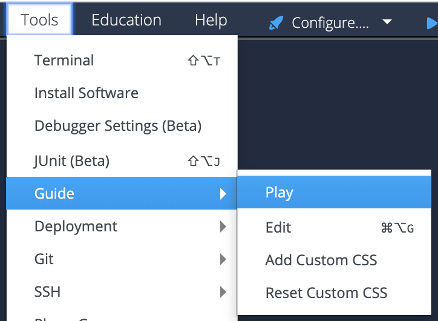

# Hello Codio with GitHub

This project is a crash course on how to setup GitHub in Codio.

## Start the Guide to see the project
If you are seeing this, you are currently in edit mode. To start Guides from this page, go to the tool bar at the top:

